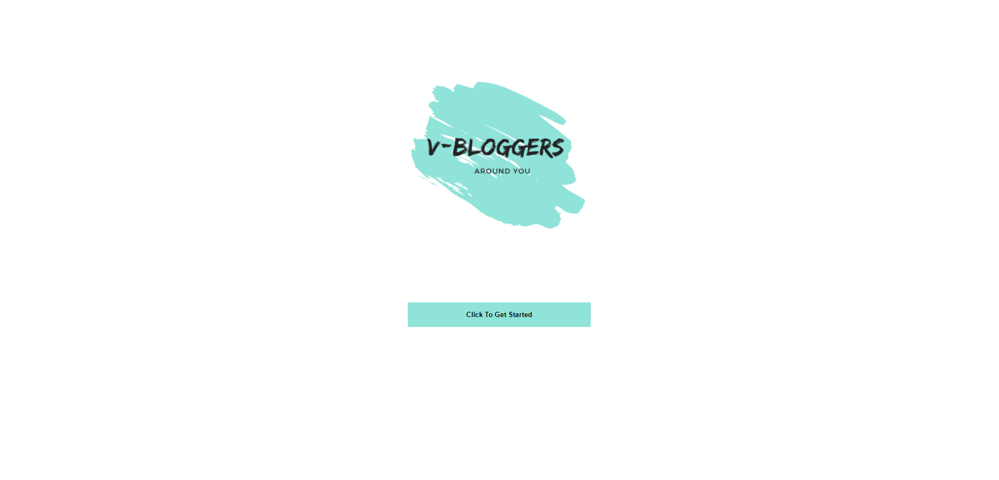
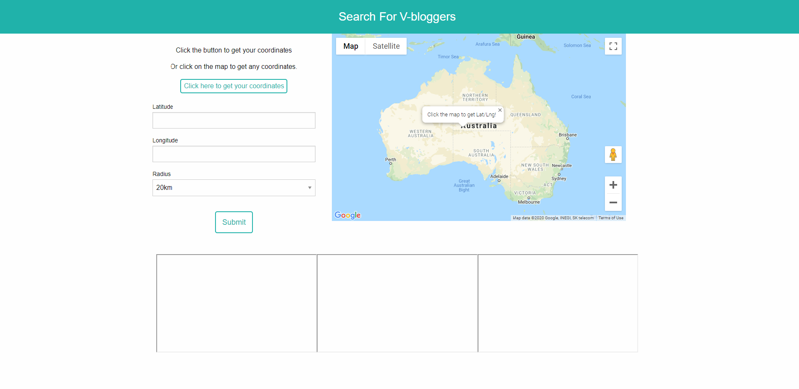
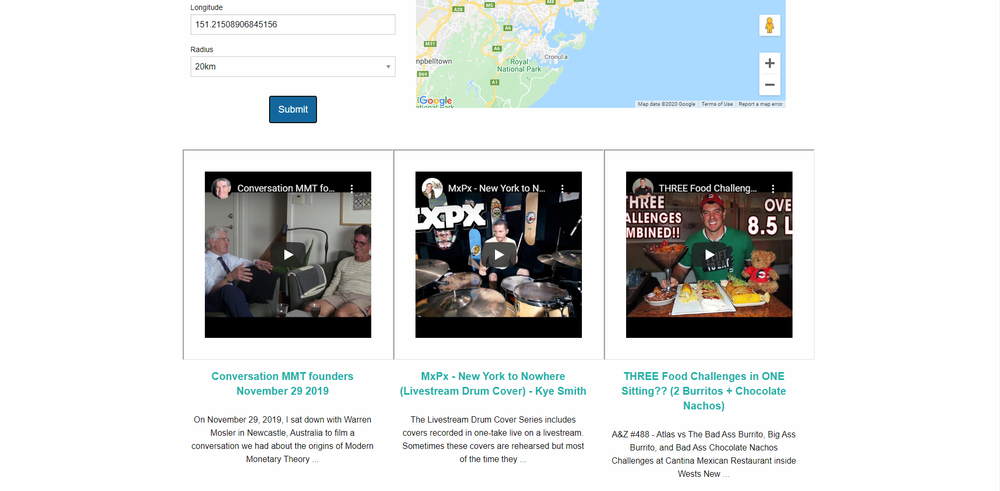

# V-Bloggers Around You

## Description 

This repository is where we developed and collaborated "V-Bloggers Around You" product. Not only do we work on code and issues here, We also publish the latested updates and functions. This source code is available to everyone under the Free Software Foundation, Inc. https//fsf.org/.

## Table of Contents (Optional)

* [Installation](#installation)
* [Usage](#usage)
* [Credits](#credits)
* [License](#license)

## Installation

There are no installation guide as it is a woking web page that you go too.(https://tarmity.github.io/v-bloggers/) 

## Usage 

To do a search on "V-Bloggers Around You" simply open the link (https://tarmity.github.io/v-bloggers/) which will bring you to the home page.
Once you are on the home page click the button to get started, it will bring up the search page which will look like the one below:

Once you are on the search page there will be a prompted from the site asking for permission to Know you Location as picutered below. 
Once you have entered your location or have used the map to pin point a area you desire then hit the summit button to bring up your V-Bloggers in that area.

## Credits

Tarmity Flassman, Melody Lo, Christopher Natale, Tripti Shrestha, Google Maps, YouTube, Canva. 

## License
  * MIT
 

